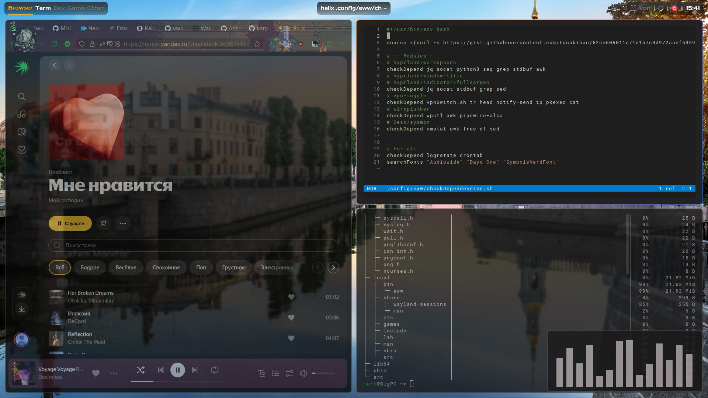
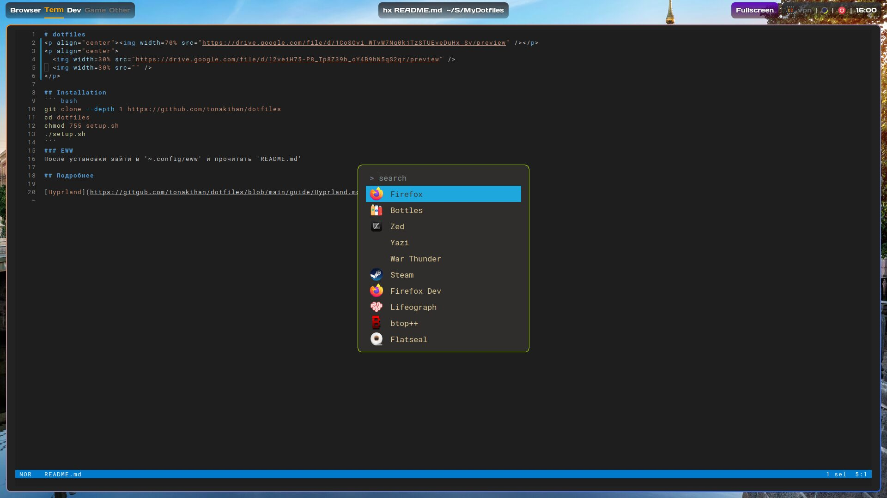

# dotfiles
<p align="center"></p>
<p align="center">
  
  
</p>

## Installation
``` bash
git clone --depth 1 https://github.com/tonakihan/dotfiles
cd dotfiles
chmod 755 setup.sh
./setup.sh
```

### After install
После установки зайти в '~.config/eww' и прочитать 'README.md'

## Подробнее

[Hyprland](https://gitgub.com/tonakihan/dotfiles/blob/main/guide/Hyprland.md)
