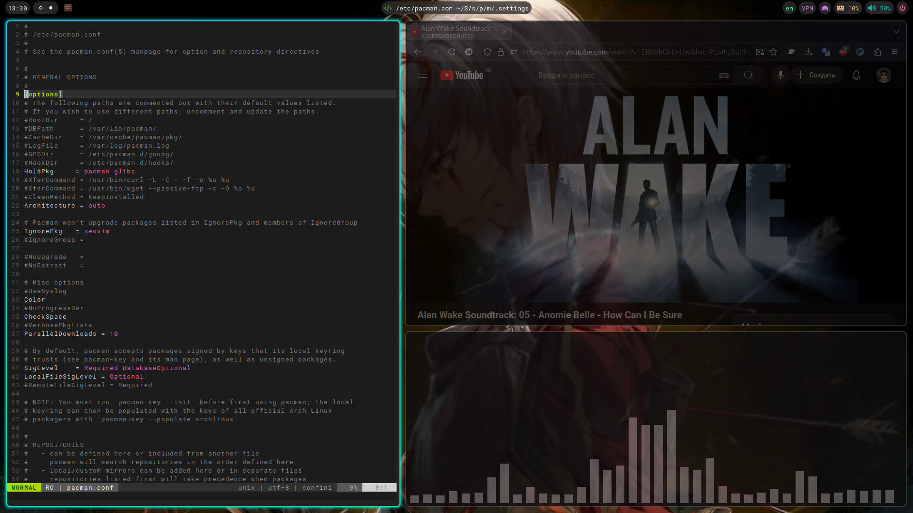

# Hyprland
<p align="center"></p>

0. Установка конфига на пк
1. Зависимости
2. Что стоит настроить под свой пк
3. Как пользоваться системой

**Рекомендации:**  
Для Arch Linux советую собирать из git, т.к. в официальном репозитории
встречаются плохие сборки.

## 0. Install
[Link to README.md](https://github.com/tonakihan/dotfiles/blob/main/README.md)

## 1. Зависимости
Обязательно установить:
```sh
hyprland xdg-desktop-portal polkit polkit-gnome dbus grim slurp dex
```

Так же для владельцев видеокарт radeon:
```sh
mesa-utils lib32-mesa opencl-mesa gamemode vulkan-tools vulkan-mesa-layers lib32-vulkan-mesa-layers vulkan-validation-layers lib32-vulkan-validation-layers lib32-vulkan-icd-loader lib32-ocl-icd vulkan-driver lib32-vulkan-driver vulkan-radeon lib32-vulkan-radeon
````

Желательно:  
`nerd fonts` - Эмодзи и спец смиволы  
`roboto mono` - Шрифт, используется почти везде в этом конфиге  
`waybar` - Верхний бар. Можно заменить на `eww`, но настраивать придется самим  
`fuzzel` - Меню приложений. Можно заменить на `wofi`, но он более проблемный  
`swww` - Обои рабочего стола  
`alacritty` - Терминал  
`hyprlock` - Блокировка экрана  
`swayidle` - Управляет автоматической блокировкой экрана по истечению времени и уходом в сон  
`hyprpicker` - Необходми `xdg-desktop-portal` для screen share  
`swaync` - Показывает всплывающие уведомления  
`loupe` - Просмоторщик изображений из gnome  
`pipewire` `wireplumber` - Аудио. Из аналогов есть `pulseaudio`  
`udiskie` - Автоматическое монтирование usb флешек  

Можно установить:  
`helix` - Текстовый редактор. Из аналогов есть `vim`, `neovim` и `nano`  
`cava` - Просто красивый аудио визуализатор  
`btop` - Полезный диспетчер задач. Аналог `htop`  
`fzf` - Очень удобный поиск файлов в системе.  
`fish` - Удобный и без необходимости глубокой настройки shell. Аналог `bash` и `zsh`  
`flatpak` `bottles` `flatseal`:  
- Flatpak - Упакованные приложения. То же самое что и `pacman`, `apt`, `snap`
- Bottles - Это oчень продуманное окружение для wine. В нем можно запускать практически любые windows программы
- Flatseal - Программа для настройки разрешений программ установленныз из flatpak

`7zip` - Архиватор. Может распоковать почти любой формат архива и упаковать.  
`refind` - Аналог `grub`, но более упрощенный и быстрый.

## 2. Что стоит настроить
<details>
  <summary><b>polkit</b></summary>
  <p>Агент аунитфикации требуется для запроса пароля через GUI, а не из терминала. Можно пропустить его настройку, если не меняете polkit-gnome.</p>  
  <p>Настроить автозапуск (dex) агента аунтификации (тут использую polkit-gnome). Подробнее <a href="https://wiki.archlinux.org/title/Polkit_(Русский)">здесь</a></p>

```sh
ln -s /usr/share/applications/polkit-gnome-authentication-agent-1.desktop $HOME/.config/autostart/
```
</details>

<details>
  <summary><b>dbus-session</b></summary>
  <p>dbus требуется для некоторых приложений, если он вам не нужен - можно не заморачиваться. Так же используется в `waybar` для 'powermenu'</p>

Создайте копию файла запуска Hyprland
```sh
sudo mkdir /usr/local/share/wayland-sessions
sudo cp /usr/share/wayland-sessions/hyprland.desktop /usr/local/share/wayland-sessions/hyprland-dbus.desktop
```
И измените файл для запуска с сессией dbus
```sh
sudo sed -i 's/Name=Hyprland/Name=Hyprland (dbus-session)/' /usr/local/share/wayland-sessions/hyprland-dbus.desktop
sudo sed -i 's/Exec=Hyprland/Exec=dbus-launch --exit-with-session Hyprland/' /usr/local/share/wayland-sessions/hyprland-dbus.desktop
```
В конце для запуска потребуется только выбрать сеанс 'Hyprland (dbus-session)' при входе в систему.
</details>

<details>
  <summary><b>terminal</b> (alacritty)</summary>

Если хочеться заменить на иной, то необходимо изменить файлы:
  - `$HOME/.config/hypr/hyprland.d/bind_key.conf`
  - `$HOME/.config/environment.d/envvars.conf`
</details>

<details open>
  <summary><b>cursor</b></summary>

Подробнее можно узнать [здесь](https://wiki.hyprland.org/Hypr-Ecosystem/hyprcursor/).  
Нужные курсоры закидывайте в `$HOME/.local/share/icons`. Далее измените на название темы курсора в `$HOME/.config/hypr/hyprland.d/env.conf`
</details>


<details>
  <summary><b>bottles</b></summary>

Если у вас есть второй диск, то настройте доступ у нему с помощью `flatseal`. Потом из 'бутылки' добавьте как новый диск.
</details>

<details open>
  <summary><b>waybar</b></summary>

Измените имя основного монитора в конфигурационном файле
```sh
sed -i "s/HDMI-A-1/$(hyprctl monitors | grep 'Monitor' | awk '{print $2}')/g" $HOME/.config/waybar/config
```
Потом просто перезапустите waybar, либо сеанс.
</details>

<details>
  <summary><b>shell</b> (fish)</summary>

TODO: Потом и возможно в другом файле
</details>

## 3. Как пользоваться
- Раскладка  
Изменить и ознакомиться можно в `$HOME/.config/hypr/hyprland.d/bind_key.conf`  
[bind_key.conf](https://github.com/tonakihan/dotfiles/tree/main/WM/hyprland/hypr/hyprland.d/bind_key.conf)

- background wrapper (swww)  
Для изменения обоев:
```sh
swww img /путь/до/вашего/изображения.img
```

- autostart (dex)  
Нужно создать '.desktop' файл в `$HOME/.config/autostart`.  
Подробнее о '.desktop' файле [здесь](https://wiki.archlinux.org/title/Desktop_entries_(Русский)) и [здесь о переменных](https://specifications.freedesktop.org/desktop-entry-spec/latest/recognized-keys.html)

- [vpnSwitch.sh](https://github.com/tonakihan/dotfiles/blob/main/Scripts/vpnSwitch.sh)  
Авторский скрипт для управление состоянием `wireguard` из `waybar`. Но перед началом необходимо настроить polkit.
Скопируйте из `etc/polkit-1` файлы в вашу систему.
```sh
sudo cp etc/polkit-1/rules.d/90-wg-quick.rules /etc/polkit-1/rules.d
```
После этого он начнет работать по клику по модулью waybar 'vpn'... Но это не точно.

