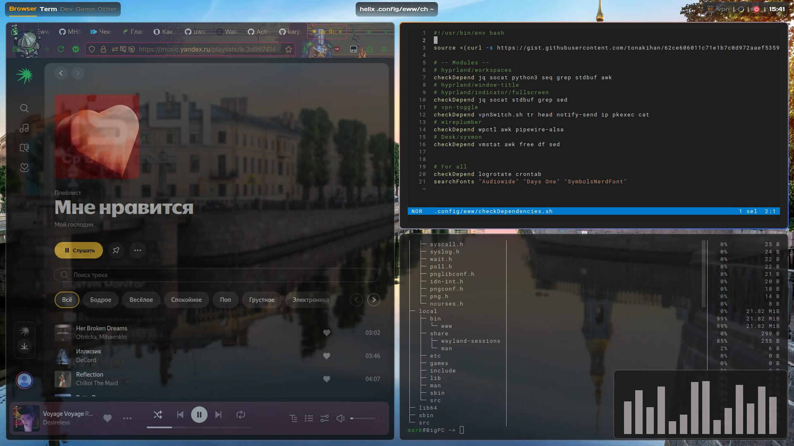

# Hyprland
<p align="center"></p>

0. [Установка конфигурационных файлов](#0-install)
1. [Зависимости](#1-зависимости)
2. [Что стоит настроить под себя](#2-что-стоит-настоить)
3. [Как пользоваться системой](#3-как-использовать)

> [!NOTE]
> 
> Под Arch Linux рекомендую собирать `hyprland` из git, т.к. в официальном репозитории
> _(pre-build bin)_ встречаются плохие сборки.

## 0. Install
[Link to README.md](https://github.com/tonakihan/dotfiles/blob/main/README.md)

## 1. Зависимости
Обязательные
```sh
hyprland xdg-desktop-portal polkit polkit-gnome dbus grim slurp dex
```
Додеп для владельцев видеокарт radeon
```sh
mesa-utils lib32-mesa opencl-mesa gamemode vulkan-tools vulkan-mesa-layers lib32-vulkan-mesa-layers vulkan-validation-layers lib32-vulkan-validation-layers lib32-vulkan-icd-loader lib32-ocl-icd vulkan-driver lib32-vulkan-driver vulkan-radeon lib32-vulkan-radeon
````

Желательно  
`nerd fonts` — Эмодзи и спец смиволы  
`roboto mono` — Шрифт, используется почти везде в этом конфиге  
`waybar` — Верхний бар. Можно заменить на `eww`, но настраивать придется самим  
`fuzzel` — Меню приложений. Можно заменить на `wofi`, но он более проблемный  
`swww` — Обои рабочего стола  
`alacritty` — Терминал  
`hyprlock` — Блокировка экрана  
`swayidle` — Управляет автоматической блокировкой экрана по истечению времени и уходом в сон  
`hyprpicker` — Необходми `xdg-desktop-portal` для screen share  
`swaync` — Показывает всплывающие уведомления  
`loupe` — Просмоторщик изображений из gnome  
`pipewire` `wireplumber` — Аудио. Из аналогов есть `pulseaudio`  
`udiskie` — Автоматическое монтирование usb флешек  

По желанию  
`helix` — Текстовый редактор. Из аналогов есть `vim`, `neovim` и `nano`  
`cava` — Просто красивый аудио визуализатор  
`btop` — Полезный диспетчер задач. Аналог `htop`  
`fzf` — Очень удобный поиск файлов в системе.  
`fish` — Удобный и без необходимости глубокой настройки shell. Аналог `bash` и `zsh`  
`flatpak` `bottles` `flatseal`:  
- Flatpak — Упакованные приложения. То же самое что и `pacman`, `apt`, `snap`
- Bottles — Это oчень продуманное окружение для wine. В нем можно запускать практически любые windows программы
- Flatseal — Программа для настройки разрешений программ установленныз из flatpak

`7zip` — Архиватор. Может распоковать почти любой формат архива и упаковать.  
`refind` — Аналог `grub`, но более упрощенный и быстрый.  
`dutree` — Наглядный анализ свободного места на диске.

## 2. Что стоит настроить
<details>
  <summary><b>polkit</b></summary>
  <blockquote>
    <b>Note:</b>Агент аунитфикации — требуется для запроса пароля через GUI, а не из терминала. 
    Можно пропустить его настройку, если не меняете polkit-gnome.
  </blockquote>
  <blockquote>
    <p>Настроить автозапуск (dex) агента аунтификации (polkit-gnome). Подробнее <a href="https://wiki.archlinux.org/title/Polkit_(Русский)">здесь</a></p>
    
  ```sh
  ln -s /usr/share/applications/polkit-gnome-authentication-agent-1.desktop $HOME/.config/autostart/
  ```

  </blockquote>
</details>

<details>
  <summary><b>dbus-session</b></summary>
  <blockquote>
    <b>Note:</b> dbus требуется для некоторых приложений, если он вам не нужен — можно не заморачиваться. 
    Так же используется в `waybar` для`<a href="../bin/Powermenu">Powermenu</a>`
  </blockquote>
  <blockquote>

  Для запуска hyprland вместе с dbus:  
    
  Клонируйте `hyprland.desktop` => `hyprland-dbus.desktop`
  ```sh
  sudo mkdir /usr/local/share/wayland-sessions
  sudo cp /usr/share/wayland-sessions/hyprland.desktop /usr/local/share/wayland-sessions/hyprland-dbus.desktop
  ```
  Измените его
  ```sh
  sudo sed -i 's/Name=Hyprland/Name=Hyprland (dbus-session)/' /usr/local/share/wayland-sessions/hyprland-dbus.desktop
  sudo sed -i 's/Exec=Hyprland/Exec=dbus-launch --exit-with-session Hyprland/' /usr/local/share/wayland-sessions/hyprland-dbus.desktop
  ```
  Теперь при входе в систему выбрете сеанс "**Hyprland (dbus-session)**"

  </blockquote>
</details>

<details>
  <summary><b>terminal</b></summary>
  <blockquote>
  
  Используется alacritty. Для изменения правте файлы:
  - `$HOME/.config/hypr/hyprland.d/bind_key.conf`
  - `$HOME/.config/environment.d/envvars.conf`

  </blockquote>
</details>

<details open>
  <summary><b>mouse cursor</b></summary>
  <blockquote>

  [Подробнее тут](https://wiki.hyprland.org/Hypr-Ecosystem/hyprcursor/)  
    
  Нужные курсоры закидывайте в `$HOME/.local/share/icons`. Далее измените на название темы курсора в `$HOME/.config/hypr/hyprland.d/env.conf`

  </blockquote>
</details>


<details>
  <summary><b>bottles</b></summary>
  <blockquote>Если у вас есть второй диск, то настройте доступ у нему с помощью `flatseal`. Потом из 'бутылки' добавьте как новый диск.</blockquote>

</details>

<details open>
  <summary><b>waybar</b></summary>
  <blockquote>

  Измение имени основного монитора в конфигурационном файле
  ```sh
  sed -i "s/HDMI-A-1/$(hyprctl monitors | grep 'Monitor' | awk '{print $2}')/g" $HOME/.config/waybar/config
  ```
  Перезапустите waybar, либо сеанс

  </blockquote>
</details>

<details>
  <summary><b>shell</b> (fish)</summary>
  <blockquote>

  TODO: Потом и возможно в другом файле

  </blockquote>
</details>

## 3. Как использовать?
- Раскладка  
  Изменить и ознакомиться можно в [`$HOME/.config/hypr/hyprland.d/bind_key.conf`](https://github.com/tonakihan/dotfiles/tree/main/WM/hyprland/hypr/hyprland.d/bind_key.conf)

- background wrapper (swww)  
  ```sh
  swww img /путь/до/вашего/изображения.img
  ```

- autostart (dex)  
  Создавайте '.desktop' файлы в `$HOME/.config/autostart`  
  Подробнее о '.desktop' файле [тут](https://wiki.archlinux.org/title/Desktop_entries_(Русский)) и
  [тут о переменных](https://specifications.freedesktop.org/desktop-entry-spec/latest/recognized-keys.html)

- [vpnSwitch.sh](https://github.com/tonakihan/dotfiles/blob/main/bin/vpnSwitch.sh) (устарело)  
  Скрипт для управление состоянием `wireguard` из `waybar`. Требует настройки polkit.
  Скопируйте файлы из `etc/polkit-1` файлы в вашу систему
  ```sh
  sudo cp etc/polkit-1/rules.d/90-wg-quick.rules /etc/polkit-1/rules.d
  ```
  После этого он начнет работать по клику на waybar 'vpn'... Но это не точно
